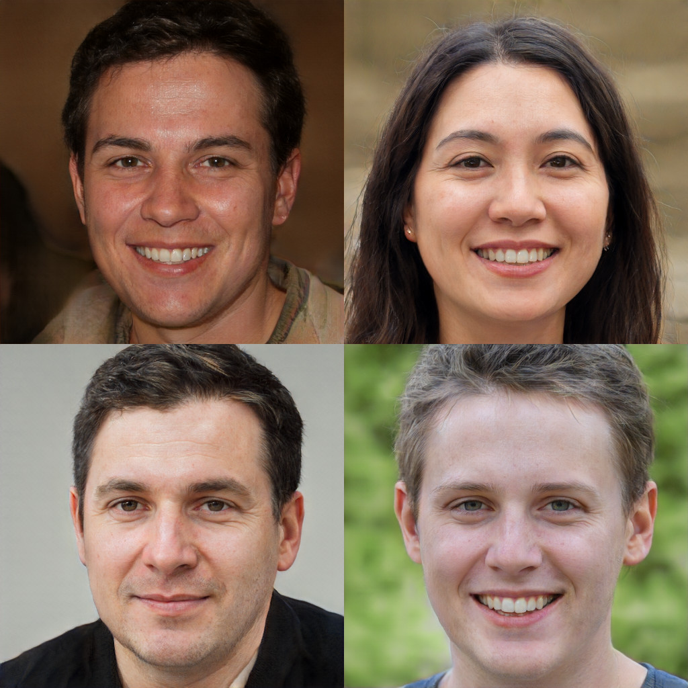

## MobileStyleGAN: A Lightweight Convolutional Neural Network for High-Fidelity Image Synthesis

Official PyTorch Implementation

<p align="center">
  
</p>

The accompanying videos can be found on [YouTube](https://www.youtube.com/playlist?list=PLstKhmdpWBtwsvq_27ALmPbf_mBLmk0uI).
For more details, please refer to the [paper](https://arxiv.org/abs/2104.04767).

## Requirements

* Python 3.8+
* 1–8 high-end NVIDIA GPUs with at least 12 GB of memory. We have done all testing and development using DL Workstation with 4x2080Ti


## Training

```bash
pip install -r requirements.txt
python train.py --cfg configs/mobile_stylegan_ffhq.json --gpus <n_gpus>
```

## Convert checkpoint from rosinality/stylegan2-pytorch

Our framework supports StyleGAN2 checkpoints format from [rosinality/stylegan2-pytorch](https://github.com/rosinality/stylegan2-pytorch).
To convert ckpt your own checkpoint of StyleGAN2 to our framework:

```bash
python convert_rosinality_ckpt.py --ckpt <path_to_rosinality_stylegan2_ckpt> --ckpt-mnet <path_to_output_mapping_network_ckpt> --ckpt-snet <path_to_output_synthesis_network_ckpt> --cfg-path <path_to_output_config_json>
```

### Check converted checkpoint

To check that your checkpoint is converted correctly, just run demo visualization:

```bash
python demo.py --cfg <path_to_output_config_json> --ckpt "" --generator teacher
```

## Generate images using MobileStyleGAN

```bash
python generate.py --cfg configs/mobile_stylegan_ffhq.json --device cuda --ckpt <path_to_ckpt> --output-path <path_to_store_imgs> --batch-size <batch_size> --n-batches <n_batches>
```

## Evaluate FID score

To evaluate the FID score we use a modified version of [pytorch-fid](https://github.com/mseitzer/pytorch-fid) library:

```bash
python evaluate_fid.py <path_to_ref_dataset> <path_to_generated_imgs>
```

## Demo

Run demo visualization using MobileStyleGAN:
```bash
python demo.py --cfg configs/mobile_stylegan_ffhq.json --ckpt <path_to_ckpt>
```

Run visual comparison using StyleGAN2 vs. MobileStyleGAN:
```bash
python compare.py --cfg configs/mobile_stylegan_ffhq.json --ckpt <path_to_ckpt>
```

## Convert to ONNX
```bash
python train.py --cfg configs/mobile_stylegan_ffhq.json --ckpt <path_to_ckpt> --export-model onnx --export-dir <output_dir>
```

## Convert to CoreML
```bash
python train.py --cfg configs/mobile_stylegan_ffhq.json --ckpt <path_to_ckpt> --export-model coreml --export-dir <output_dir>
```

## Deployment using OpenVINO

We provide external library [random_face](https://github.com/bes-dev/random_face) as an example of deploying our model at the edge devices using the [OpenVINO](https://github.com/openvinotoolkit/openvino) framework.

## Pretrained models

|Name|FID|
|:---|:--|
|[mobilestylegan_ffhq.ckpt](https://drive.google.com/uc?id=11Kja0XGE8liLb6R5slNZjF3j3v_6xydt)|7.75|

(*) Our framework supports automatic download pretrained models, just use `--ckpt <pretrined_model_name>`.

## Legacy license

|Code|Source|License|
|:---|:-----|:------|
|[Custom CUDA kernels](core/models/modules/ops/)|https://github.com/NVlabs/stylegan2|[Nvidia License](LICENSE-NVIDIA)|
|[StyleGAN2 blocks](core/models/modules/legacy.py)|https://github.com/rosinality/stylegan2-pytorch|MIT|

## Acknowledgements

We want to thank the people whose works contributed to our project::
* Tero Karras, Samuli Laine, Miika Aittala, Janne Hellsten, Jaakko Lehtinen, Timo Aila for research related to style based generative models.
* Kim Seonghyeon for implementation of StyleGAN2 in [PyTorch](https://github.com/rosinality/stylegan2-pytorch).
* Fergal Cotter for implementation of Discrete Wavelet Transforms and Inverse Discrete Wavelet Transforms in [PyTorch](https://github.com/fbcotter/pytorch_wavelets).
* Cyril Diagne for the excellent [demo of how to run MobileStyleGAN directly into the web-browser](https://github.com/cyrildiagne/mobilestylegan-web-demo).

## Citation

If you are using the results and code of this work, please cite it as:

```
@misc{belousov2021mobilestylegan,
      title={MobileStyleGAN: A Lightweight Convolutional Neural Network for High-Fidelity Image Synthesis},
      author={Sergei Belousov},
      year={2021},
      eprint={2104.04767},
      archivePrefix={arXiv},
      primaryClass={cs.CV}
}

@article{BELOUSOV2021100115,
      title = {MobileStyleGAN.pytorch: PyTorch-based toolkit to compress StyleGAN2 model},
      journal = {Software Impacts},
      year = {2021},
      issn = {2665-9638},
      doi = {https://doi.org/10.1016/j.simpa.2021.100115},
      url = {https://www.sciencedirect.com/science/article/pii/S2665963821000452},
      author = {Sergei Belousov},
}
```
